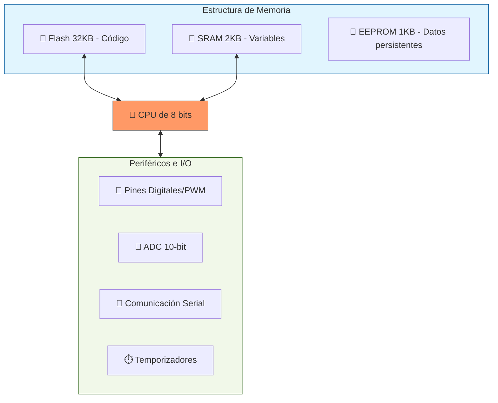
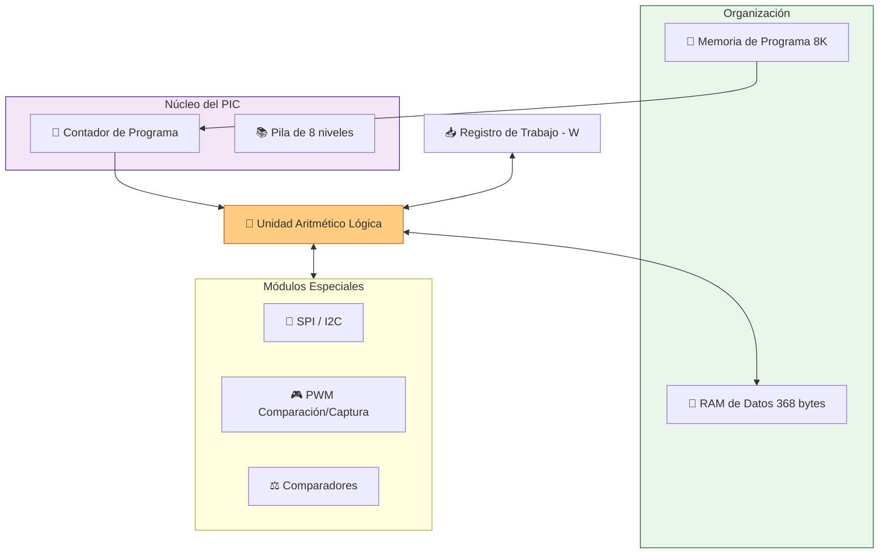
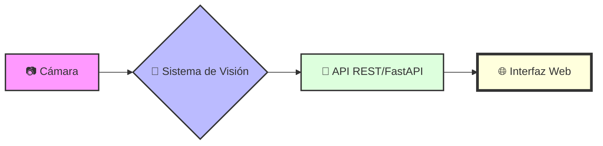
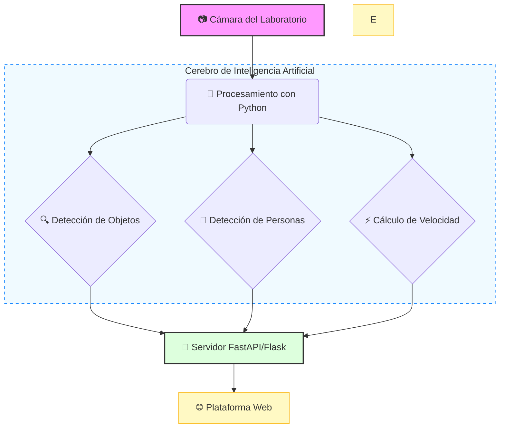
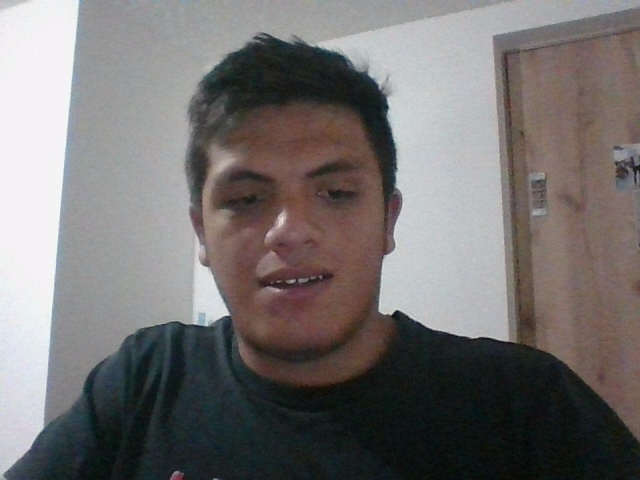

# Parcial-sistemas-embebidos-corte-1
Parcial corte 1

# Parte 1

Responda las siguientes preguntas a continuación:

* # ¿Qué son los microcontroladores y los microprocesadores?

los microcontroladores son circuitos integrados programables que contienen todos los componentes en un mismo circuito, pueden contener memorias pequeñas integradas para que cuando se programen no requieran de discos externos de almacenamiento, ademas que son muy usuados para sistemas que no requieran de mucho almacenamiento como procesos de iot, y los microprocesadoresson los dispositivos que realizan la funcion de cpu, en un unico circuito integrado, es capas de almacenar varias cpus. pero no son integrados ya que manejan alto volumen de datos requieren de elementos externos como unidades de almacenamientos para guardar los datos, son requeridos o usuados para computadoras por su gran cantidad de procesamientos a realizar 

* # Defina la arquitectura Von Neumann y la Arquitectura de Harvard además: Exponer sus características, ventajas y diferencias.
   
* Von Neumann
La arquitectura de Von neumann, describe que los almacenamientos estan en una sola memoria
* vemtajas
  Unica memoria para datos y programas.
  Secuencialidad: La CPU procesa una instrucción a la vez
  Es típico de los pc clásicos, sistemas de micro procesados y computadores de propósito general
  
* Harvard
La arquitectura Harvard es un modelo de diseño de computadoras en el que la memoria para instrucciones y la memoria para datos están separadas físicamente, y cada una tiene su propio bus de acceso.
* vemtajas
La memoria de instrucciones es independiente de la memoria de datos.
El procesador puede leer instrucciones y datos al mismo tiempo porque usa dos buses diferentes.

* diferencias
Meroria mientras en von neumann tiene una unica memoria el harvad cuentan con memorias diferentes
Modelo neumann cuenta con unico bus y harvadr tiene buses diferentes

*  Desventajas
Costos operativos
Utilidad en proyectos, no puedo usar una arquitectura neumann donde la capacidad de datos de almacenamiento puede superar la capacidad de memoria. 

* # ¿Qué son los procesadores tipos RISC y tipo CISC?

* RISC
Son procesadores que permiten manejar varias tareas o intrucciones, ademas cuenta con la capacidad de ser versatil al realizar varias intrucciones complejas.

* CISC
Son procesadores que cumplen pocas intrucciones sin afectar el servicio del ordenador, son bastantes faciles de trabajar al tener menor intruccion que cumplir ideal para tareas sencillas o de unica orden

* # ¿Qué es ARM (Advanced RISC Machine)?

Es una familia de arquitecturas de procesadores basada en el diseño RISC, creada para priorizar la eficiencia energética y elrendimiento en dispositivos con recursos limitados.

* # Exponer sus características, ventajas y si es muy usado en la actualidad.?

Menor consumo de energia
Eficiencia rics
Flexibilidad y escabilidad
Soporte y tecnologias avanzadas

* # ¿Cuál es la arquitecura de Arduino? Y ¿qué características tiene?

Arquitectura Harvard
CPU (Unidad Central de Procesamiento)
Memoria
Entradas y salidas
Periféricos integrados D y A

### 🕹️ Arquitectura de Arduino



* # ¿Cuál es la arquitectura del pic 16F887 y sus principales características?
  
Arquitectura Harvard
Bus separado para instrucciones y datos
La mayoría de instrucciones se ejecutan en 1 ciclo de instrucción

### 📟 Arquitectura del PIC 16F887



# parte 2

Plantee una solución paso a paso de las situaciones descritas con loaprendido en clase:

El propósito de los estudiantes de ingeniería de telecomunicaciones decompensar es el planteamiento de una plataforma que permita elreconocimiento de las herramientas que existen en un laboratorio y también alas personas que están en el mismo donde se observe si se movilizan a unavelocidad prudente o si están generando movimientos muy rápidos por medio desistemas embebidos. Formule de manera robusta lo siguiente: 

* ## ¿Cómo plantearía el desarrollo de una base de datos con imágenes de los diferentes elementos de un laboratorio de telecomunicaciones?

* Desarrollo de una base de datos con imágenes de los elementos del laboratorio
Para que el sistema pueda reconocer herramientas y objetos del laboratorio, primero es necesario crear un conjunto de datos (dataset) de imágenes.

* Paso 1: Identificación de los elementos

Se deben definir los objetos que el sistema reconocerá. Por ejemplo: osciloscopio, multímetro, fuente de poder, router switch, cables de red protoboard, antenas y computadores

* Paso 2: Captura de imágenes

Se deben tomar fotografías reales en el laboratorio.

* Buenas prácticas: tomar entre 100 y 300 imágenes por objeto

* Variar: angulos, iluminación, distancia y fondo

* Paso 3: Etiquetado de imágenes, cada imagen debe estar clasificada por su tipo de objeto.

Herramientas recomendadas:

* ### LabelImg

* ### Roboflow

* ### CVAT

Las etiquetas permiten entrenar el modelo de reconocimiento.

* Paso 4: Preprocesamiento de imágenes

Antes del entrenamiento se realizan:

Redimensionamiento (por ejemplo 224x224)

Normalización, y eliminación de ruido Con librerías como:

* ### OpenCV

* ### TensorFlow

* ### PyTorch

* # ¿Cómo crearía un sistema clasificador de elementos con la librería media pipe?

La librería MediaPipe permite realizar reconocimiento de objetos y detección en tiempo real usando cámaras.

* Paso 1: Instalación de librerías

```bash
# La base para procesar imágenes y video
pip install opencv-python

# El motor de IA para detección de personas y manos (MediaPipe)
pip install mediapipe

# El framework de redes neuronales de Google
pip install tensorflow
```

* Paso 2: Captura de video desde la cámara

```bash
#python
import cv2

cap = cv2.VideoCapture(0)

while True:
    ret, frame = cap.read()
    
    cv2.imshow("Camara Laboratorio", frame)

    if cv2.waitKey(1) & 0xFF == 27:
        break

cap.release()
cv2.destroyAllWindows()
```
Paso 3: Integración con MediaPipe, permite detectar personas y posiciones del cuerpo mediante Pose Detection.

```bash
import mediapipe as mp

mp_pose = mp.solutions.pose
pose = mp_pose.Pose()

results = pose.process(frame)
```

* # ¿Cómo reconocería el sistema la velocidad de las personas en el laboratorio?

* Reconocimiento de la velocidad de las personas en el laboratorio, Para detectar si las personas se mueven muy rápido se puede usar MediaPipe Pose.
* Paso 1: Obtener coordenadas del cuerpo, mediaPipe devuelve coordenadas: (x , y , z)

* Paso 2: Calcular desplazamiento, se guarda la posición anterior y la actual.

velocidad = distancia / tiempo. El método consiste en calcular el desplazamiento entre frames.

* Paso 3: Clasificación de movimiento, Se puede definir un umbral.

Ejemplo:

| Velocidad | Clasificación |
| :--- | :--- |
| < 0.02 | Movimiento normal |
| 0.02 - 0.05 | Movimiento rápido |
| > 0.05 | Movimiento peligroso |

* # ¿Cómo haría un despliegue en una plataforma web o móvil?
  
## Arquitectura



Tecnologías recomendadas:

| Backend | Frontend |
| :--- | :--- |
| Python | HTML |
| Flask | CSS  |
| FastAPI | JavaScript  |

La página puede mostrar:

* Video en tiempo real

* Objetos detectados

* Velocidad de personas

* Alertas

## Arquitectura completa del sistema



# Parte Empírica


* ### Crear un algoritmo sencillo que solo me muestre puntos en el pulgar

Generamos un algoritmo de prueba par ejecutar en visual stede code y validar que la camara si nos permita, pero primero intalamos la libreria de 

```bash
pip install mediapipe
```

despues subimos nuestro algoritmo a visual 

```bash
import cv2

# Abrir cámara
cap = cv2.VideoCapture(0)

while True:
    ret, frame = cap.read()

    if not ret:
        print("No se pudo abrir la cámara")
        break

    # Mostrar cámara
    cv2.imshow("Camara", frame)

    tecla = cv2.waitKey(1) & 0xFF

    # Presionar 'f' para tomar foto
    if tecla == ord('f'):
        cv2.imwrite("foto_pulgar.jpg", frame)
        print("Foto guardada")

    # Presionar ESC para salir
    if tecla == 27:
        break

cap.release()
cv2.destroyAllWindows()
```

Imagen capturada por el algoritmo:



Generamos el codigo definito debemod de intalar las librerias primero 


```bash
pip install opencv-python mediapipe
```

```bash
import cv2
import mediapipe as mp

# Inicializar la detección de manos
mp_hands = mp.solutions.hands
hands = mp_hands.Hands()

# Abrir la cámara
cap = cv2.VideoCapture(0)

while True:

    # Leer imagen de la cámara
    ret, frame = cap.read()

    # Voltear la imagen como espejo
    frame = cv2.flip(frame, 1)

    # Convertir imagen de BGR a RGB
    rgb = cv2.cvtColor(frame, cv2.COLOR_BGR2RGB)

    # Procesar la imagen para detectar la mano
    results = hands.process(rgb)

    # Si detecta una mano
    if results.multi_hand_landmarks:
        for hand in results.multi_hand_landmarks:

            h, w, c = frame.shape

            # Puntos del pulgar
            puntos_pulgar = [1,2,3,4]

            for punto in puntos_pulgar:

                x = int(hand.landmark[punto].x * w)
                y = int(hand.landmark[punto].y * h)

                # Dibujar punto
                cv2.circle(frame,(x,y),10,(0,255,0),-1)

    # Mostrar imagen
    cv2.imshow("Deteccion de pulgar", frame)

    # Salir con ESC
    if cv2.waitKey(1) == 27:
        break
```


